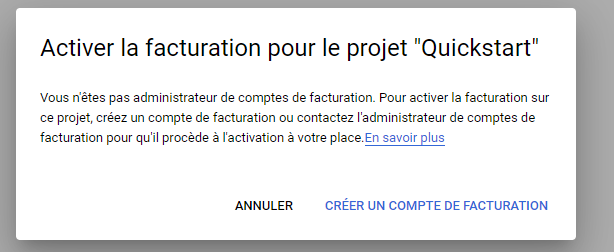

# Introduction

Geoguess 2 est un jeu gratuit sans publicité. Les joueurs s'affrontent en 5 manches pour deviner la plus proche position d'où ils ont été placé aléatoirement.

Vous avez la possibilité de jouer avec vos amis. Le premier joueur créé une salle et décide de sa taille. Une fois créés, les autres joueurs pourront rejoindre la salle à partir de son nom et joueur tous ensemble.
Ce jeu est issu de [GeoGuess Master](https://geoguessmaster.com/).

Ce guide explique comment mettre en place le jeu Geoguess. 

# 1) Deploiement

Vous pouvez déployer le site via les outils suivants:

 or 

# 2) Variable d'environnement

## 2.1) Google Map VUE_APP_API_KEY

> Si vous avez déjà manipuler Google Cloud, nous vous inivitons à lire la partie [2.1.2](./#_2-1-2-google-cloud-je-connais-%F0%9F%92%AA)

1. Google Cloud 1er projet
    1. Aller sur https://cloud.google.com/maps-platform/
    2. Cliquer sur Premiers pas
    3. Une page s'ouvre et vous demande d'activer la facturation
    
    > **Note :** Google offre 200 $ de crédit mensuel pour l'usage des apis de Google Map ([Source](https://cloud.google.com/maps-platform/pricing?hl=fr)). Pour un usage entre amis, vous ne dépasserai jamais ce montant.
    4. Créer votre compte de facturation

1.(bis) Google Cloud, je connais 💪: Créer un projet 

2. Dans le MarketPlace Activer l'api "Maps JavaScript API"
3. Dans l'onglet Identifiants, géénérer une clé d'api. Cette clé sera votre `VUE_APP_API_KEY`
> Vous pouvez définir un quotat et une restrinction d'url

Plus d'infos : [https://developers.google.com/maps/gmp-get-started](https://developers.google.com/maps/gmp-get-started)