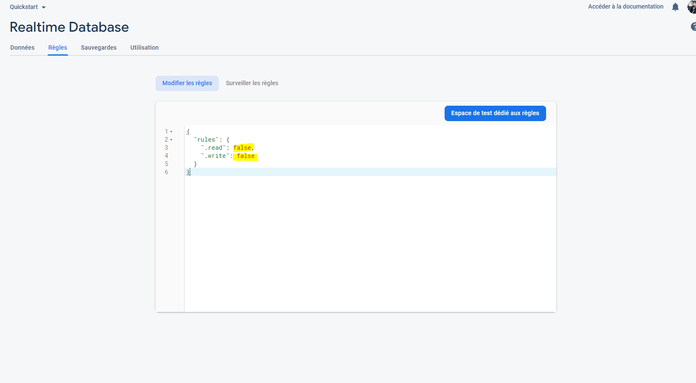

# Geoguess Guide

Geoguess is a free game. Players compete how close the player can guess random locations in five rounds. 
You can play multiplayer with your friends. The first player creates a room and decides the room size. Other players type the same room name as the first player created and the game will start.

This game was forked from [GeoGuess Master](https://geoguessmaster.com/).

This guide explains how to deploy your own server GeoGuess.

## 1) Instruction to deploy

You can deploy the game with : 

 or 

It will be ask to give Environment variables, we will explain how to create and find them.

## 2) Environment variables

### 2.1) Google Map

> Environnement variable : VUE_APP_API_KEY

1. Google Cloud, your 1st project ?
    1. Go to [https://cloud.google.com/maps-platform/](https://cloud.google.com/maps-platform/)
    2. Click on "Get started"
    3. Page will open and ask you to activate billing
    
    > **Note :** Google offers 200 $ credit per month to use Google Map Apis ([Source](https://cloud.google.com/maps-platform/pricing)). For personal usage, you won't use more than the free credit.
    4. Create Billing Account

1.(bis) Google Cloud, I know 💪 then create a project

2. In the "MarketPlace", activate "Maps JavaScript API"
3. In "Identifiants", generate on API key. This key will be your `VUE_APP_API_KEY`
> You can define quota et restriction

> More information : [https://developers.google.com/maps/gmp-get-started](https://developers.google.com/maps/gmp-get-started)

### 2.2) Firebase (multiplayer)

> Environment variables : VUE_APP_FIREBASE_API_KEY, VUE_APP_FIREBASE_PROJECT_ID, VUE_APP_FIREBASE_MESSAGING_SENDER_ID, VUE_APP_FIREBASE_APP_ID et VUE_APP_FIREBASE_MEASUREMENT_ID

1. Create a Firebase project (or use the Google Cloud project create for Google Map Api) on [https://console.firebase.google.com/](https://console.firebase.google.com/)
> You can activate Google Analytics to get statistics
2. Go in the section "Develop" and click on "Realtime Database", create a database
3. Go in the Rules Section
    1. Replace, 2 variable (.write et .read) `false` by `true` in the textarea

    2. Publish

1. Return on the home page with "Project Overview" 
2. Under the title of the project, click on Web icon `</>` to add an application

1. Save the application then get Environment variables reveals under `firebaseConfig` 

Here are the associations:

| Parameter         | Env. Variables                       |
| ----------------- | ------------------------------------ |
| apiKey            | VUE_APP_FIREBASE_API_KEY             |
| projectId         | VUE_APP_FIREBASE_PROJECT_ID          |
| messagingSenderId | VUE_APP_FIREBASE_MESSAGING_SENDER_ID |
| appId             | VUE_APP_FIREBASE_APP_ID              |
| measurementId     | VUE_APP_FIREBASE_MEASUREMENT_ID      |

> **Note**: `measurementId` was accessible if you have activate Google Analytics
