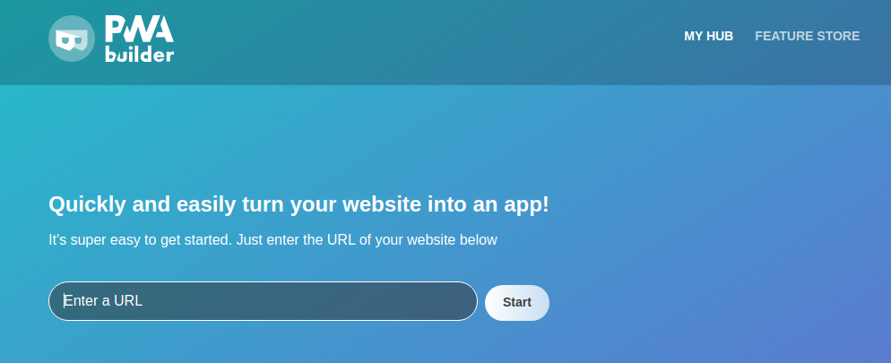
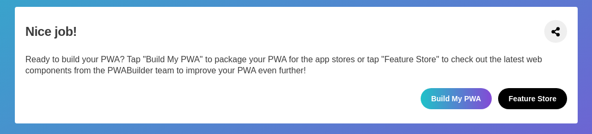
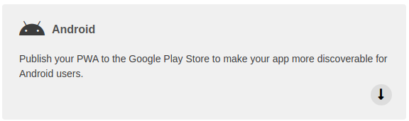
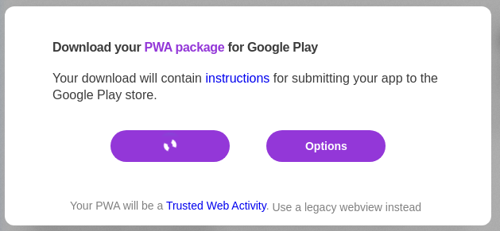

# Generate an GeoGuess apk (TWA)

Since 2020, Google has launch [Trusted Web Activity (TWA)](https://developer.chrome.com/docs/android/trusted-web-activity/overview/) a way to switch Progressive Web App (PWA) to an Android application.

For this tutorial, we use PwaBuilder but if you want make it by your own with [Google integration Guide](https://developer.chrome.com/docs/android/trusted-web-activity/integration-guide/)

 1. Go on [pwabuilder.com](https://www.pwabuilder.com/)
    - Enter your url game server
 

 2. Wait and click on Build My PWA
 

 3. Select Android    
 

 4. Click on Download     
 

 5. Follow instruction : [Next-steps.md](https://github.com/pwa-builder/CloudAPK/blob/master/Next-steps.md)